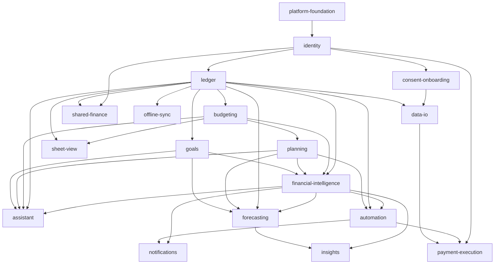

# Capability Map: Budgetify Mobile

Status: **accepted product direction** — revised for the Financial OS vision on
2026-09-13. Individual module specs still require review before implementation.

The rebuild bundles many independently testable capabilities. Each row below is a
module with a stable kebab-case id. Ids are chosen once and never renamed; specs,
plans and tasks select work by id, so `SPEC-ledger.md` is always the ledger spec.

## Modules

| Module id | Responsibility | Depends on | Release |
|---|---|---|---|
| `platform-foundation` | Monorepo, Expo app shell, TypeScript config, design tokens, navigation skeleton, CI, Supabase project + migration tooling | — | V1 |
| `identity` | Supabase Auth, session persistence, device security, and RLS identity boundary | `platform-foundation` | Core |
| `consent-onboarding` | First-run profile, currency, safety buffer, income cadence, consent, privacy controls, export, and erase | `identity` | Core |
| `ledger` | Accounts, cash, categories, and transactions: the single source of truth for money movement | `identity` | Core |
| `budgeting` | Category allocations, period math, spending pace, and adaptive adjustment proposals | `ledger` | Core |
| `planning` | Bills, subscriptions, planned purchases, recurring commitments, salary allocation, and completion state | `ledger`, `budgeting` | Core |
| `goals` | Savings goals, contribution plans, milestones, and target-date alternatives | `ledger` | Core |
| `financial-intelligence` | Safe-to-Spend, affordability, financial health, anomaly detection, and explainable recommendations | `ledger`, `budgeting`, `planning`, `goals` | Core |
| `assistant` | Context-aware text and voice orchestration. Tools call reviewed domain operations and return action proposals. | `ledger`, `budgeting`, `planning`, `goals`, `financial-intelligence` | Core |
| `forecasting` | Future timeline, projected balances, confidence, cash-flow risks, and What If scenarios | `ledger`, `planning`, `goals`, `financial-intelligence` | Intelligence |
| `automation` | Opt-in natural-language rules, recurring categorization, reminders, prepared actions, approvals, undo, and audit history | `ledger`, `planning`, `financial-intelligence` | Intelligence |
| `notifications` | AI Inbox, push tokens, decision queues, budget and bill alerts, quiet hours, and preferences | `financial-intelligence`, `automation` | Intelligence |
| `insights` | Explainable trends, money-leak detection, monthly reports, comparisons, and report export | `financial-intelligence`, `forecasting` | Intelligence |
| `data-io` | CSV/XLSX import, receipt scanning, document extraction, report export, and read-only bank ingestion | `ledger`, `consent-onboarding` | Connected |
| `shared-finance` | Households, member permissions, shared obligations, reimbursements, and AI-assisted splits | `identity`, `ledger` | Connected |
| `payment-execution` | Provider-backed transfers and bill payment with step-up authorization, idempotency, and audit controls | `identity`, `automation`, `data-io` | Later |
| `offline-sync` | Local-first cache, optimistic writes, conflict resolution, and background sync | `ledger` | Later |
| `sheet-view` | Optional dense editable grid for power users; not part of primary mobile navigation | `budgeting`, `ledger` | Later |

## Dependency graph



No cycles. `assistant` depends on the money modules and never the reverse. The AI
is a client and orchestrator of domain operations, not an alternative financial
system. If it writes to Postgres directly, bypasses the approval model, or owns a
second implementation of financial math, the product becomes untrustworthy.

## Build order

```
platform-foundation
  └─ identity + consent-onboarding
       └─ ledger
            ├─ budgeting
            ├─ planning
            └─ goals
                 └─ financial-intelligence
                      ├─ assistant          ← Core experience
                      ├─ forecasting
                      └─ automation
                           ├─ notifications
                           └─ insights      ← Intelligence experience
                                ├─ data-io
                                └─ shared-finance
                                     ├─ payment-execution
                                     ├─ offline-sync
                                     └─ sheet-view
```

After `ledger`, budgeting, planning, and goals can advance as separate vertical
slices. Forecasting and automation remain separate from assistant presentation,
so their calculations and authorization rules can be tested without an LLM.

## Scope boundaries

The **Core experience** is complete when a user can authenticate, establish
accounts and preferences, record money movement, maintain plans and goals, see a
truthful Safe-to-Spend state, and use text AI to understand or prepare those same
operations for review.

The **Intelligence experience** adds recurring detection, future timeline,
forecasting, financial health, voice input, adaptive proposals, automations,
Inbox, and explainable reports.

The **Connected experience** adds read-only financial ingestion, receipt and
document understanding, and shared finances. External money movement remains a
separate Later capability and cannot be implied by an in-app automation.

Every domain operation is a typed, validated operation shared by UI and AI.
Financial recommendations show their inputs and confidence. Writes are
user-scoped under RLS, prepared actions require review, external money movement
requires explicit authenticated approval, and all reversible actions expose an
undo path.
