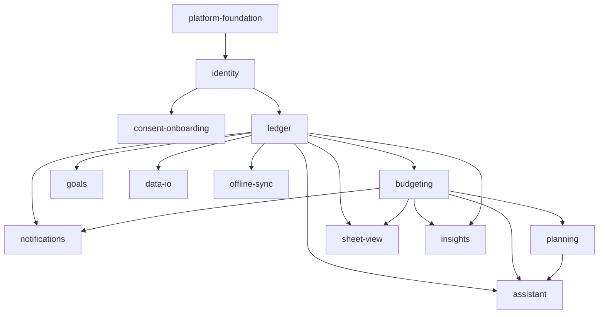

# Capability Map: Budgetify Mobile

Status: **proposed** — awaiting sign-off before any module spec is written.

The rebuild bundles many independently testable capabilities. Each row below is a
module with a stable kebab-case id. Ids are chosen once and never renamed; specs,
plans and tasks select work by id, so `SPEC-ledger.md` is always the ledger spec.

## Modules

| Module id | Responsibility | Depends on | Release |
|---|---|---|---|
| `platform-foundation` | Monorepo, Expo app shell, TypeScript config, design tokens, navigation skeleton, CI, Supabase project + migration tooling | — | V1 |
| `identity` | Supabase Auth: email/password, Google and Facebook OAuth, session persistence, biometric unlock, RLS base policies | `platform-foundation` | V1 |
| `consent-onboarding` | First-run flow, GDPR consent capture, privacy/terms acceptance, data-rights surface (export + erase), currency/locale setup | `identity` | V1 |
| `ledger` | Accounts, categories, transactions. The single source of truth for money movement. Every other money feature reads from here. | `identity` | V1 |
| `budgeting` | Monthly per-category budgets, period math, spent/remaining/over-budget derivation | `ledger` | V1 |
| `notifications` | Expo push tokens, budget-threshold and bill-due alerts, quiet hours, per-channel preferences | `ledger`, `budgeting` | V1 |
| `planning` | Planned items and recurring bills with due dates; mark done/undone; completing a planned item materialises a transaction in `ledger` | `budgeting` | V2 |
| `sheet-view` | Spreadsheet-style editable grid over budget lines and transactions — keyboard/gesture cell editing, bulk edit, column sort | `budgeting`, `ledger` | V2 |
| `assistant` | Voice + text chatbot. On-device STT → LLM tool-calling → TTS. Tools are thin wrappers over the other modules' public operations. | `ledger`, `budgeting`, `planning` | V2 |
| `insights` | Reports, charts, trends, month-over-month comparison, PDF share | `ledger`, `budgeting` | V3 |
| `goals` | Savings goals with target amount, deadline, contribution tracking | `ledger` | V3 |
| `data-io` | CSV/XLSX import of bank statements with column mapping, and export of reports | `ledger` | V3 |
| `offline-sync` | Local-first cache, optimistic writes, conflict resolution, background sync | `ledger` | V3 |

## Dependency graph



No cycles. `assistant` depends on the money modules and never the reverse — the
chatbot is a client of domain operations, not a participant in them. This is the
load-bearing constraint of the whole design: if the assistant is ever allowed to
write to Postgres directly, its tool surface and the app's business rules drift
apart and the two disagree about what a valid budget is.

## Build order

```
platform-foundation
  └─ identity
       ├─ consent-onboarding
       └─ ledger
            └─ budgeting
                 └─ notifications          ← V1 ships here
                      ├─ planning
                      │    └─ assistant
                      └─ sheet-view        ← V2 ships here
                           ├─ insights
                           ├─ goals
                           ├─ data-io
                           └─ offline-sync ← V3
```

`consent-onboarding` and `ledger` can be built in parallel once `identity` lands.
`insights`, `goals`, `data-io` and `offline-sync` are mutually independent.

## Scope boundaries

V1 is defined as: a user can sign up, consent, add accounts and categories,
record transactions, set monthly budgets, and get pushed when a budget is
breached. Anything not on that list is out of V1 — including the assistant.

The assistant is the headline feature, so V1 must not architecturally preclude
it. The mitigation is that every V1 domain operation is written as a pure,
callable function in `packages/core` with an explicit input schema. When
`assistant` is built, its tool definitions are generated from those same schemas
rather than hand-written a second time.
