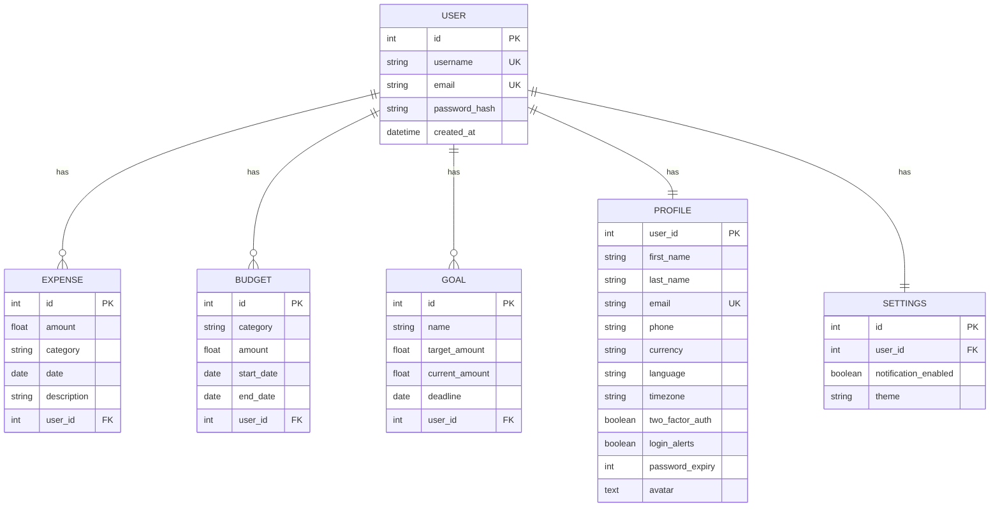

# Legacy audit — Budgetify web application

Audit of the code archived at tag `v1.0-legacy-web` and in `legacy/`. This is a
record of what the application actually was, captured before the rebuild so that
no behaviour is lost by accident.

## Backend — Flask 3.0.3, SQLAlchemy 2.0, MySQL

### Data model

Notable properties: amounts are `Float`, category is a free-text `String(50)` on
both Expense and Budget with no reference table, and there is no account or
income concept — every row is an outflow.

### Endpoints

| Method | Path | Purpose |
|---|---|---|
| POST | `/api/auth/register` | Create user |
| POST | `/api/auth/login` | Return JWT |
| POST | `/api/auth/logout` | No-op (stateless) |
| POST | `/api/auth/request-otp` | Email a 6-digit OTP |
| POST | `/api/auth/verify-otp` | Consume OTP |
| GET POST | `/api/expenses` | List / create |
| PUT DELETE | `/api/expenses/<id>` | Update / delete |
| GET POST | `/api/budget` | List / create |
| PUT DELETE | `/api/budget/<id>` | Update / delete |
| GET POST | `/api/goals` | List / create |
| PUT DELETE | `/api/goals/<id>` | Update / delete |
| GET POST PUT DELETE | `/api/profile` | Profile CRUD |
| GET POST | `/api/profile/avatar` | Avatar fetch / upload |
| GET | `/api/reports/monthly` | Month totals, per-category, budget and goal progress |
| GET PUT | `/api/settings` | Notification flag, theme |
| GET | `/api/testmail/send` | Debug endpoint, hardcoded recipient |

### Cross-cutting

- **Auth:** Flask-JWT-Extended, bcrypt password hashing. `generate_token` issues
  a **1-minute** expiry, which the frontend works around by treating any 401 as
  a logout.
- **OTP:** generated and stored in a module-level Python dict with a 10-minute
  expiry. Lost on restart, not shared across workers.
- **CORS:** enabled globally with no origin restriction.
- **Ownership:** enforced per service function by filtering on `user_id`. Correct
  everywhere it was checked, but it is a convention, not a guarantee.
- **Integrations:** Flask-Mail over SMTP; Google Drive v3 for avatars, writing to
  one hardcoded folder id.
- **Tests:** none. Only `tests/insert-mocked-data.py`, a seeding script.

## Frontend — React 18.3.1, Create React App

Pages: Home, Login, Register, CompleteProfile, Dashboard, Expenses, Budget,
Reports, Settings, PrivacyPolicy, TermsOfService, Support, NotFound.

Component groups under `src/components/`: `Home/` (6 marketing sections),
`Dashboard/` (Overview, ExpenseSummary, BudgetSummary, SpendingPatterns,
Notifications), `Expense/` (form, list, chart), `Budget/` (overview, categories,
chart, modal), `Reports/` (controls, summary cards, four chart types),
`Settings/` (six panels), plus `DMT/` which is a dark-mode toggle that mutates
`document.body.classList`.

- **API client** (`src/utils/api.js`): Axios with a request interceptor that
  injects the bearer token *and* fetches the profile on every single request to
  decide whether to redirect to `/complete-profile` — a network round-trip per
  call.
- **State:** `useState` only. No context, no cache, no global store.
- **Styling:** CSS Modules plus Bootstrap 5, plus `styled-components` installed
  but barely used. No tokens.
- **Export:** jsPDF + autotable for PDF, hand-concatenated strings for CSV.
- **Tests:** test runner configured, zero test files.

### What was incomplete

1. **Goals** — full backend CRUD, no UI, not even exposed in the API client.
2. **Password change, data export, account deletion** — UI present, backend absent.
3. **Notifications** — dashboard calls `getNotifications()`; no such endpoint exists.
4. **Social login** — `SocialLogin.js` and `SocialRegister.js` render buttons that do nothing.
5. **Register** — posts to the API but never persists the returned token.
6. **OTP** — endpoints exist but are not wired into registration.
7. **No roles, no realtime, no offline behaviour, no code splitting.**

## Deployment

Two DigitalOcean droplets plus a managed MySQL cluster requiring a CA
certificate at `CA_CERTIFICATE_PATH`. Gunicorn behind Nginx. Frontend built to a
static bundle. No CI pipeline.
